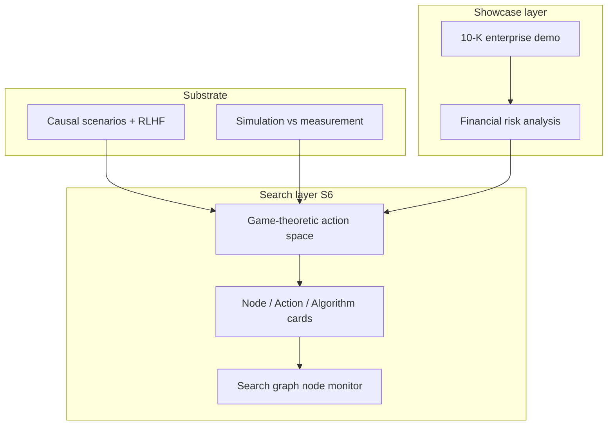

# Project Track — Scenario Reasoner LM

**Purpose:** One page so contributors do not lose the thread when adding game-theoretic search, financial domains, or algorithm abstractions.

## North star (unchanged)

1. **Headline showcase:** Five source-grounded catastrophic enterprise risk scenarios from one bundled 10-K (`docs/enterprise-risk-demo.md`).
2. **Research substrate:** Causal/counterfactual scenarios, θ-robust eval, DPO + monitoring (`docs/scenario-search-formulation.md`).
3. **S5 machinery:** Simulation (θ → trace) vs measurement (scores, slices) — `docs/scenario-simulation-paths.md`.

Everything new must **extend** S = (X, Θ, T, A, R, Ω), not replace enterprise or causal paths.

## Layer cake (how pieces fit)



| Layer | What it is | Primary Θ / artifact |
| --- | --- | --- |
| Substrate | Template scenarios, rewards, DPO | `CausalTheta` |
| Showcase | Auditable filing-grounded cards | `EnterpriseRiskTheta`, `EnterpriseRiskScenarioCard` |
| S5 | Wide vs bounded paths, path audit | `simulation_runner`, `reasoning_path_audit` |
| **S6 (new)** | Math-structured search + operators | `GameTheoreticTheta`, search **cards**, `SearchGraphMonitor` |
| Financial extension | Risk + optional market-making **reasoning** | `FinancialRiskTheta`, `MarketMakingReasoningTheta` |

## What S6 adds (your request, scoped)

| Request | In scope now | Deferred / skipped |
| --- | --- | --- |
| Game-theoretic search (actions, interaction) | `GameTheoreticTheta` with staged `action_vector`; contract + ADR | Full Nash solvers, live multi-agent envs |
| Large action vectors (e.g. dim 10 per stage) | Normalized vector + stage→action map | Learned embeddings in production |
| Manifolds | Feasible-set projection on simplex/box (`ActionManifold`) | Riemannian optimization, learned manifolds |
| Monitor search through nodes | `SearchGraphMonitor` + span/node cards | Real-time GPU dashboards |
| Cards for node / action / algorithm | `src/search/cards.py` | UI for every operator type |
| Financial risk space | `FinancialRiskTheta` extends enterprise pattern | Live SEC, trading execution |
| Market making reasoning | `MarketMakingReasoningTheta` — search over **reasoning templates** | Live order books, PnL claims |

## Milestone map

| Milestone | Status | Doc |
| --- | --- | --- |
| Causal substrate + RLHF scaffold | Implemented | `README.md`, `PROJECT_STRUCTURE.md` |
| S2 Enterprise 10-K demo | Implemented | `docs/enterprise-risk-demo.md` |
| S4 Eval + optimizers | Scaffold | `docs/eval-enterprise-risk.md` |
| S5 Simulation vs measurement | Ongoing | `docs/scenario-simulation-paths.md` |
| **S6 Search extensions** | **Contract + stubs** | `docs/scenario-search-extensions-contract.md` |

## Default command paths (still valid)

```bash
# Enterprise demo (headline)
python scripts/run_enterprise_demo.py --offline

# Causal data + training
python scripts/generate_scenarios.py --help
python scripts/train.py --config experiments/configs/causal_rlhf_config.json --output-dir experiments/results/run

# S5 smoke tests
pytest tests/unit/test_scenario_simulation_runner.py tests/unit/test_search_graph_monitor.py -v
```

## Decision: do not fork the philosophy

- **Scenario = parameterized search problem** (paths + leaves under Ω).
- **Enterprise θ stays source of truth** for the 10-K benchmark; financial θ **extends** it.
- **Market making** = search over reasoning approaches for audit/research, not financial advice or execution.
- **Cards** = serializable operators for composition and tracing, not a second framework beside `ScenarioBase`.
