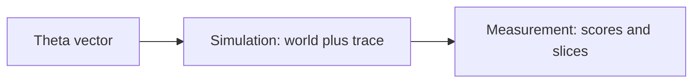

# Scenario Simulation and Measurement Paths

**Vault seeds:** S5-01 … S5-06 · **Milestone:** S5 — Scenario simulation and measurement paths  
**Status:** ongoing · **Target due:** 2026-07-18 (documentation through S5-06)

## North-star alignment

| Goal | Path | Primary Θ |
| --- | --- | --- |
| Five grounded catastrophic enterprise scenarios from one 10-K | Bounded enterprise simulation + enterprise eval | `EnterpriseRiskTheta` |
| Causal RLHF and robustness research | Wide/bounded causal simulation + causal metrics | `CausalTheta` |

`EnterpriseRiskTheta` **parallels** `CausalTheta`; it does not replace causal abstractions. See `src/scenarios/theta_mapping.py` for the explicit axis map and `enterprise_theta_to_causal_slice()` for cross-harness reporting.

## Simulation vs measurement



| | Simulation | Measurement |
| --- | --- | --- |
| **Flow** | θ → world → trace | Fixtures or traces → metrics → report |
| **Output** | Span chains, scenario instances, path counts | Aggregate scores, per-θ slices, pass/fail |
| **Default provider** | Mock / smoke | Bundled fixtures only |
| **Entrypoint** | `scripts/run_scenario_simulation.py` | `scripts/run_scenario_measurement.py` |

## Two simulation path types

### 1. Wide / exploratory (many scenarios)

Use when exploring a large search tree:

- **Grid sweep** — `EnterpriseRiskThetaSampler.grid()` or `CausalThetaSampler.grid()`
- **Tree expansion** — MCTS / policy-guided expansion (see `docs/scenario-search-formulation.md`)
- **Monte Carlo** — small perturbations in θ produce many distinct paths (`path_mode=wide`)

Bundled fixture: `enterprise_wide_grid`, `causal_wide_monte_carlo` in `data/eval/simulation_fixtures.json`.

### 2. Bounded / staged (limited scenarios)

Use when cardinality must stay tractable for demos and exec review:

- **Enterprise** — five ranked cards (default demo), or staged severity ladder
- **Causal** — good / neutral / bad or fixed stage list
- **Stress labels** — good, bad, worst case without enumerating full θ product

Bundled fixture: `enterprise_bounded_default`, `causal_bounded_direct`.

## When to simulate vs measure vs defer live run

| Situation | Action |
| --- | --- |
| Explore θ sensitivity or many paths | **Simulate** (wide), mock provider |
| Demo five 10-K scenarios or staged causal cases | **Simulate** (bounded), offline stubs |
| Regression on rubric, goal preservation, θ slices | **Measure** on bundled fixtures |
| Optimizer comparison (BootstrapFewShot vs MIPRO) | **Measure** via `run_enterprise_eval.py` (offline default) |
| Paid API, GPU training, live SEC | **Defer** until sprint gate — see resource gates below |

## Resource gates (live runs)

| Gate | Env var | Default | Effect |
| --- | --- | --- | --- |
| LLM provider | `LLM_PROVIDER` | `offline` | Offline stubs in demo pipeline |
| Live provider approval | `ALLOW_LIVE_PROVIDER` | unset | Must be `1` for simulation `--live` or paid calls |
| Execution sprint | `EXECUTION_SPRINT_GATE` | unset | Must be `1` for full reasoning eval `--full` pipeline |
| MIPRO optimizer | `ENABLE_MIPRO` | unset | MIPRO only when set |
| Langfuse export | `LANGFUSE_PUBLIC_KEY`, `LANGFUSE_SECRET_KEY` | unset | In-memory spans only; no-op when absent |

**Development and CI:** mock/smoke only. Full pipeline runs (simulation + measurement + live eval) are scheduled for a complete S5 sprint — until then, run **unit tests** only:

```bash
pytest tests/unit/test_scenario_simulation_runner.py \
       tests/unit/test_goal_preservation_metrics.py \
       tests/unit/test_scenario_measurement.py \
       tests/unit/test_enumerated_path_generator.py \
       tests/unit/test_exploratory_path_generator.py \
       tests/unit/test_scenario_reasoning_batch.py \
       tests/unit/test_cross_scenario_coherence_metrics.py \
       tests/unit/test_scenario_reasoning_eval.py \
       tests/integration/test_reasoning_path_audit_smoke.py -v
```

Optional local artifact generation (no network):

```bash
python scripts/run_scenario_simulation.py
python scripts/run_scenario_measurement.py --smoke --output docs/eval/results/scenario_measurement
python scripts/run_scenario_reasoning_eval.py --smoke --output docs/eval/results/scenario_reasoning
```

## EnterpriseRiskTheta ↔ causal θ taxonomy

| Enterprise axis | Causal parallel | Role |
| --- | --- | --- |
| `filing_id` | `domain` | Subject anchor |
| `num_scenarios` | `chain_length` | Structural depth / count |
| `severity_floor` | `difficulty` | Strictness of outcomes |
| `focus_sections` | `entity_count` | Evidence / graph breadth |
| `critique_passes` | `num_confounders` | Refinement depth |
| `ranking_strategy` | `intervention_type` | Selection / query type |

Headline benchmark unchanged: **five catastrophic scenarios from one bundled 10-K**.

## Goal preservation and path audit (S5-03 … S5-05)

| Component | Path |
| --- | --- |
| Goal / on-target metrics | `src/metrics/goal_preservation_metrics.py` |
| Off-target regression fixtures | `data/eval/goal_preservation_fixtures.jsonl` |
| Measurement schema | `src/eval/scenario_measurement_schema.py` |
| Reasoning path fidelity | `src/monitoring/reasoning_path_audit.py` |
| Manual trace review | `manual_trace_review_instructions()`; Langfuse optional |

## Multi-scenario reasoning paths (S6 / S7)

| Component | Path |
| --- | --- |
| Enumerated path generator | `src/scenarios/enumerated_path_generator.py` |
| Exploratory path generator | `src/scenarios/exploratory_path_generator.py` |
| Batch reasoning (mock/smoke) | `src/scenarios/scenario_reasoning_batch.py` |
| Cross-scenario coherence metrics | `src/metrics/cross_scenario_coherence_metrics.py` |
| Reasoning eval schema | `src/eval/scenario_reasoning_eval_schema.py` |
| Reasoning eval harness | `scripts/run_scenario_reasoning_eval.py` |
| Enumerated fixtures | `data/scenarios/enumerated_path_fixtures.json` |
| Exploratory fixtures | `data/scenarios/exploratory_path_fixtures.json` |
| Coherence fixtures | `data/eval/cross_scenario_coherence_fixtures.jsonl` |

### Execution sprint vs fixture measurement (S7-06)

| Mode | When | Gate | Command |
| --- | --- | --- | --- |
| **Unit/smoke (default)** | Every PR, local dev, CI | None | `pytest tests/unit/test_*path*.py …` |
| **Fixture measurement** | Regression on bundled paths | None | `python scripts/run_scenario_reasoning_eval.py --smoke` |
| **Execution sprint** | Approved sprint window only | `EXECUTION_SPRINT_GATE=1` | `EXECUTION_SPRINT_GATE=1 python scripts/run_scenario_reasoning_eval.py --full` |

**Keep measuring on fixtures** during normal development. Run the **execution sprint** only when:

- Sprint window is approved for live/GPU/paid API exploratory+enumerated pipeline runs
- Budget and `ALLOW_LIVE_PROVIDER=1` are in place for any live provider step
- Artifacts are archived under `docs/eval/results/scenario_reasoning/`

CI runs unit/smoke pytest only. The execution-sprint workflow is `workflow_dispatch` and gated on `EXECUTION_SPRINT_GATE`.

## Decision log (S5)

| Date | Decision | Rationale |
| --- | --- | --- |
| 2026-05-20 | **Simulation ≠ measurement** | Generation/exploration separated from scored eval harness |
| 2026-05-20 | **Two path modes: wide vs bounded** | Wide for search/MC; bounded for demo and exec cardinality |
| 2026-05-20 | **No live runs in dev/CI** | `ALLOW_LIVE_PROVIDER` gate; pytest smoke only until full sprint |
| 2026-05-20 | **No new domains until scaffold** | Stabilize runners and fixtures before expanding Θ domains |
| 2026-05-20 | **Deferred live SEC** | Bundled 10-K remains headline benchmark (S2 decision preserved) |
| 2026-05-20 | **Extend Θ, do not replace causal** | `EnterpriseRiskTheta` parallels `CausalTheta` |

## Artifacts

| Artifact | Path |
| --- | --- |
| ADR | `docs/adr/simulation-vs-measurement.md` |
| Simulation runner | `src/scenarios/simulation_runner.py` |
| Simulation CLI | `scripts/run_scenario_simulation.py` |
| Measurement CLI | `scripts/run_scenario_measurement.py` |
| Fixtures | `data/eval/simulation_fixtures.json`, `data/eval/goal_preservation_fixtures.jsonl` |
| Results dir | `docs/eval/results/scenario_measurement/` |
| CI smoke | `.github/workflows/scenario_simulation_smoke.yml` |
| S6/S7 reasoning eval CI | `.github/workflows/scenario_reasoning_eval_smoke.yml` |

## Related

- [Enterprise Risk Demo Contract](enterprise-risk-demo.md)
- [Scenario search formulation](scenario-search-formulation.md)
- [Scenario search extensions (S6)](scenario-search-extensions-contract.md)
- [Project track](project-track.md)
- [Langfuse tracing](langfuse-tracing.md)
